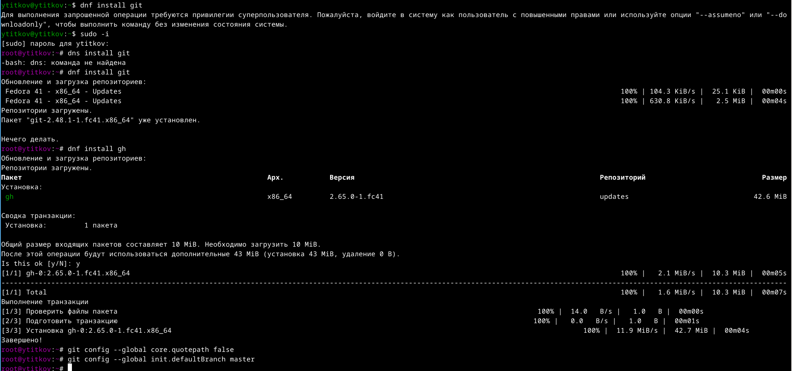
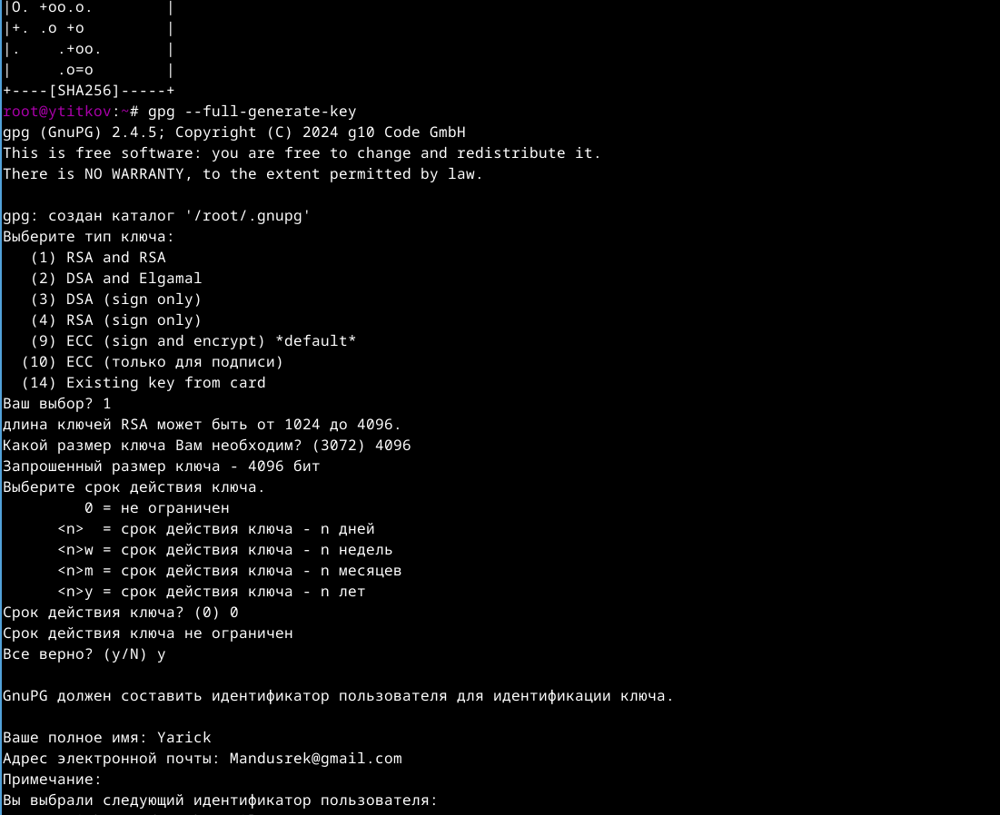
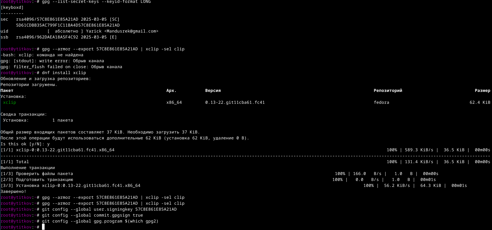
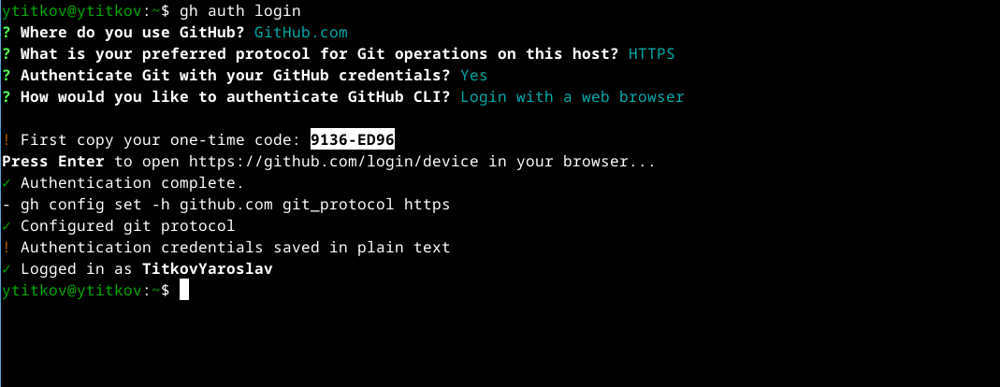
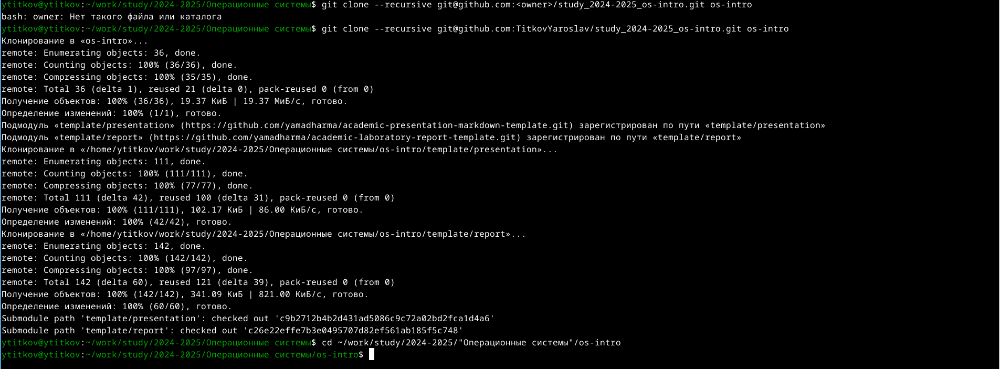
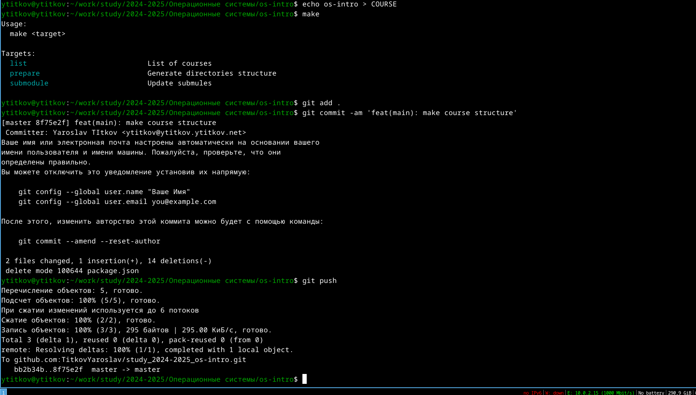

---
## Front matter
lang: ru-RU
title: Лабораторная работа №2
subtitle: Операционные сисетмы
author:
  - Титков Ярослав Максимович
institute:
  - Российский университет дружбы народов, Москва, Россия
  - 
## i18n babel
babel-lang: russian
babel-otherlangs: english

## Formatting pdf
toc: false
toc-title: Содержание
slide_level: 2
aspectratio: 169
section-titles: true
theme: metropolis
header-includes:
 - \metroset{progressbar=frametitle,sectionpage=progressbar,numbering=fraction}
---

## Цель работы

Освоить умения по работе с git.

## Задание

1. Создать базовую конфигурацию для работы с git.
2. Создать ключ SSH.
3. Создать ключ PGP.
4. Настроить подписи git.
5. Зарегистрироваться на Github.
6. Создать локальный каталог для выполнения заданий по предмету.

## Установка всего необходимого ПО

С помощью команды `dnf install git` установим нужное ПО.

{ #fig:001 width=70% }

Создадим индивидуальный ключ под мою систему.

## Настройка для дальнейшей работы

С помощью определенных команд, таких как `git config`, настроили среду для работы.

## Получение индивидуального кода

С помощью команды `git login` я создал индивидуальный код для сопряжения системы и GitHub.

## Скачивание репозитория

Скопировал нужный мне репозиторий для дальнейшей работы.

## Создание среды для работы с Git

Создал всю необходимую среду для дальнейшей работы с Git.

# Заключение

В ходе выполнения лабораторной работы я приобрел важные навыки в работе с Git и создал среду для дальнейшего пользования.
