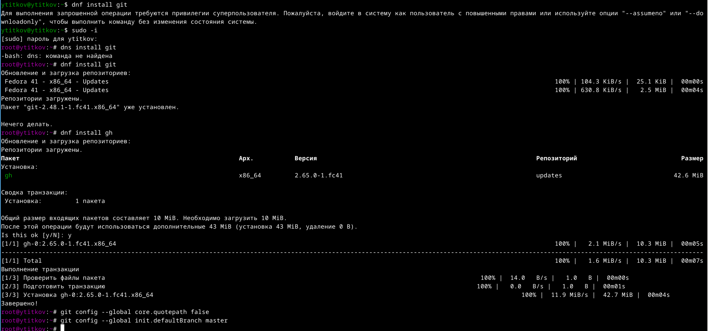
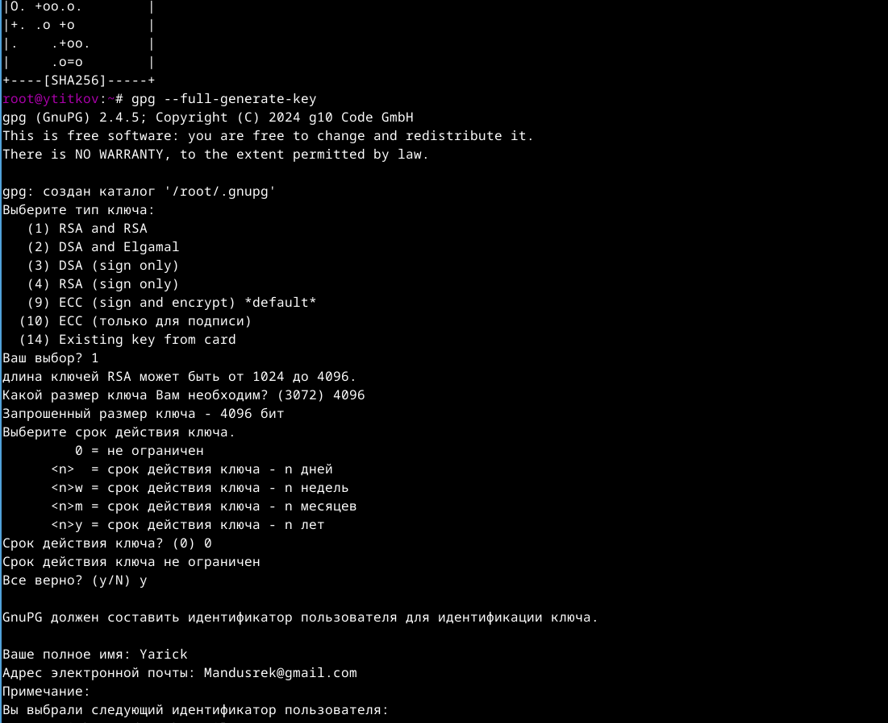
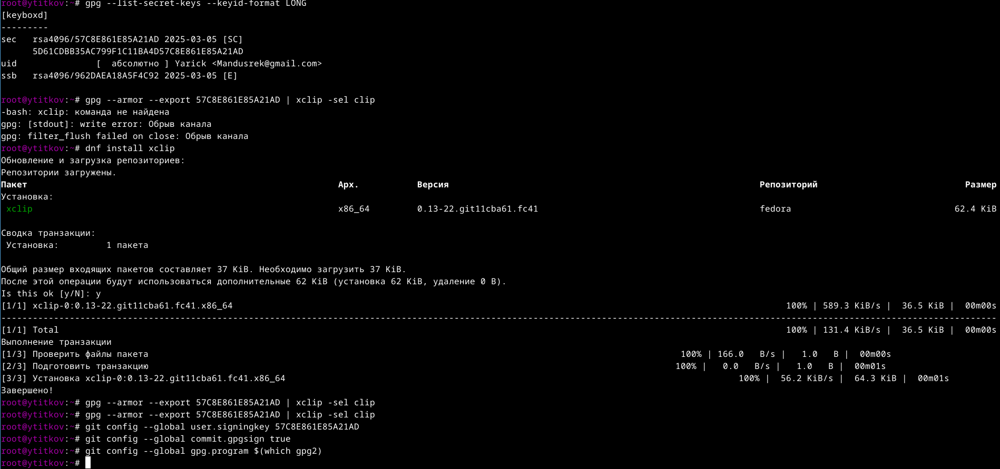
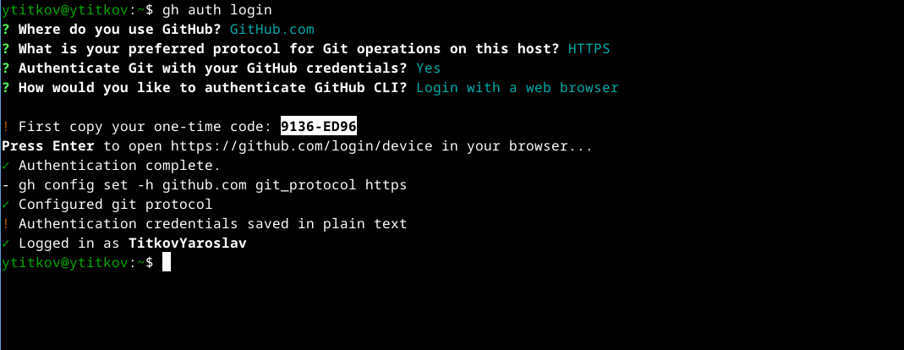
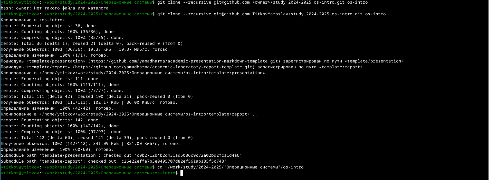
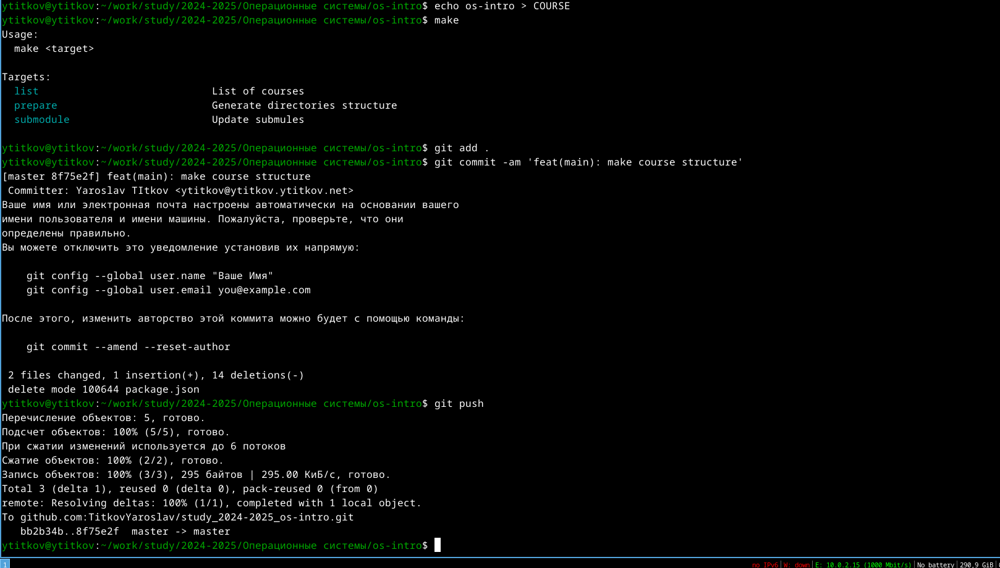

---
## Front matter
title: "Лабораторная работа номер 2"
subtitle: "Выполнение лабораторной работы"
author: "Титков Ярослав Максимович"

## Generic otions
lang: ru-RU
toc-title: "Содержание"

## Bibliography
bibliography: bib/cite.bib
csl: pandoc/csl/gost-r-7-0-5-2008-numeric.csl

## Pdf output format
toc: true # Table of contents
toc-depth: 2
lof: true # List of figures
lot: true # List of tables
fontsize: 12pt
linestretch: 1.5
papersize: a4
documentclass: scrreprt
## I18n polyglossia
polyglossia-lang:
  name: russian
  options:
	- spelling=modern
	- babelshorthands=true
polyglossia-otherlangs:
  name: english
## I18n babel
babel-lang: russian
babel-otherlangs: english
## Fonts
mainfont: IBM Plex Serif
romanfont: IBM Plex Serif
sansfont: IBM Plex Sans
monofont: IBM Plex Mono
mathfont: STIX Two Math
mainfontoptions: Ligatures=Common,Ligatures=TeX,Scale=0.94
romanfontoptions: Ligatures=Common,Ligatures=TeX,Scale=0.94
sansfontoptions: Ligatures=Common,Ligatures=TeX,Scale=MatchLowercase,Scale=0.94
monofontoptions: Scale=MatchLowercase,Scale=0.94,FakeStretch=0.9
mathfontoptions:
## Biblatex
biblatex: true
biblio-style: "gost-numeric"
biblatexoptions:
  - parentracker=true
  - backend=biber
  - hyperref=auto
  - language=auto
  - autolang=other*
  - citestyle=gost-numeric
## Pandoc-crossref LaTeX customization
figureTitle: "Рис."
tableTitle: "Таблица"
listingTitle: "Листинг"
lofTitle: "Список иллюстраций"
lotTitle: "Список таблиц"
lolTitle: "Листинги"
## Misc options
indent: true
header-includes:
  - \usepackage{indentfirst}
  - \usepackage{float} # keep figures where there are in the text
  - \floatplacement{figure}{H} # keep figures where there are in the text
---

# Цель работы

    Изучить идеологию и применение средств контроля версий.
    Освоить умения по работе с git.

# Задание
1.Создание Гит ключей
2.Подключение репрезитория 
3. Работа с GitHub

# Теоретическое введение
Системы контроля версий. Общие понятия

Системы контроля версий (Version Control System, VCS) применяются при работе нескольких человек над одним проектом. Обычно основное дерево проекта хранится в локальном или удалённом репозитории, к которому настроен доступ для участников проекта. При внесении изменений в содержание проекта система контроля версий позволяет их фиксировать, совмещать изменения, произведённые разными участниками проекта, производить откат к любой более ранней версии проекта, если это требуется.

В классических системах контроля версий используется централизованная модель, предполагающая наличие единого репозитория для хранения файлов. Выполнение большинства функций по управлению версиями осуществляется специальным сервером. Участник проекта (пользователь) перед началом работы посредством определённых команд получает нужную ему версию файлов. После внесения изменений, пользователь размещает новую версию в хранилище. При этом предыдущие версии не удаляются из центрального хранилища и к ним можно вернуться в любой момент. Сервер может сохранять не полную версию изменённых файлов, а производить так называемую дельта-компрессию — сохранять только изменения между последовательными версиями, что позволяет уменьшить объём хранимых данных.

Системы контроля версий поддерживают возможность отслеживания и разрешения конфликтов, которые могут возникнуть при работе нескольких человек над одним файлом. Можно объединить (слить) изменения, сделанные разными участниками (автоматически или вручную), вручную выбрать нужную версию, отменить изменения вовсе или заблокировать файлы для изменения. В зависимости от настроек блокировка не позволяет другим пользователям получить рабочую копию или препятствует изменению рабочей копии файла средствами файловой системы ОС, обеспечивая таким образом, привилегированный доступ только одному пользователю, работающему с файлом.

Системы контроля версий также могут обеспечивать дополнительные, более гибкие функциональные возможности. Например, они могут поддерживать работу с несколькими версиями одного файла, сохраняя общую историю изменений до точки ветвления версий и собственные истории изменений каждой ветви. Кроме того, обычно доступна информация о том, кто из участников, когда и какие изменения вносил. Обычно такого рода информация хранится в журнале изменений, доступ к которому можно ограничить.

В отличие от классических, в распределённых системах контроля версий центральный репозиторий не является обязательным.

Среди классических VCS наиболее известны CVS, Subversion, а среди распределённых — Git, Bazaar, Mercurial. Принципы их работы схожи, отличаются они в основном синтаксисом используемых в работе команд.

# Выполнение лабораторной работы

{#fig:001 width=70%}

{#fig:002 width=70%}

{#fig:003 width=70%}

{#fig:004 width=70%}

{#fig:005 width=70%}

{#fig:006 width=70%}

# Выводы
В ходе работы я освоил и научился пользоваться Git

# Контрольные вопросы:

Системы контроля версий (VCS)

Инструменты для управления изменениями в файлах. Используются для истории изменений, совместной работы и отката.
Основные понятия VCS:

    Хранилище (репозиторий) — база данных с версиями файлов.
    Commit — фиксация изменений с комментарием.
    История — последовательность коммитов.
    Рабочая копия — локальные файлы для работы.

Централизованные и децентрализованные VCS

    Централизованные (CVCS): Одно главное хранилище. Пример: SVN.
    Децентрализованные (DVCS): У каждого своя копия репозитория. Пример: Git, Mercurial.

Действия с VCS при единоличной работе:

    Создать репозиторий (git init).
    Добавить файлы (git add).
    Фиксировать изменения (git commit).
    Просматривать историю (git log).

Работа с общим хранилищем:

    Клонировать репозиторий (git clone).
    Получать изменения (git pull).
    Отправлять изменения (git push).
    Решать конфликты при необходимости.

Основные задачи Git:

    Управление версиями.
    Совместная работа.
    Ветвление и слияние.
    Отслеживание изменений.

Основные команды Git:

    git init — создать репозиторий.
    git add — добавить файлы в индекс.
    git commit — зафиксировать изменения.
    git status — проверить состояние.
    git log — посмотреть историю.
    git clone — скопировать репозиторий.
    git pull — получить изменения.
    git push — отправить изменения.
    git branch — управление ветками.
    git merge — слияние веток.

Примеры работы с Git:

    Локальный репозиторий:

        git init
        git add file.txt
        git commit -m "Initial commit"

    Удаленный репозиторий:

        git clone https://github.com/user/repo.git
        git pull
        git push origin main

Ветви (branches)

    Используются для изоляции изменений (например, для новой функции или исправления).
    Создать ветку: git branch new-feature.
    Переключиться на ветку: git checkout new-feature.

Игнорирование файлов

    Файл .gitignore указывает, какие файлы не добавлять в репозиторий (например, временные файлы или логи).
    Пример .gitignore:
