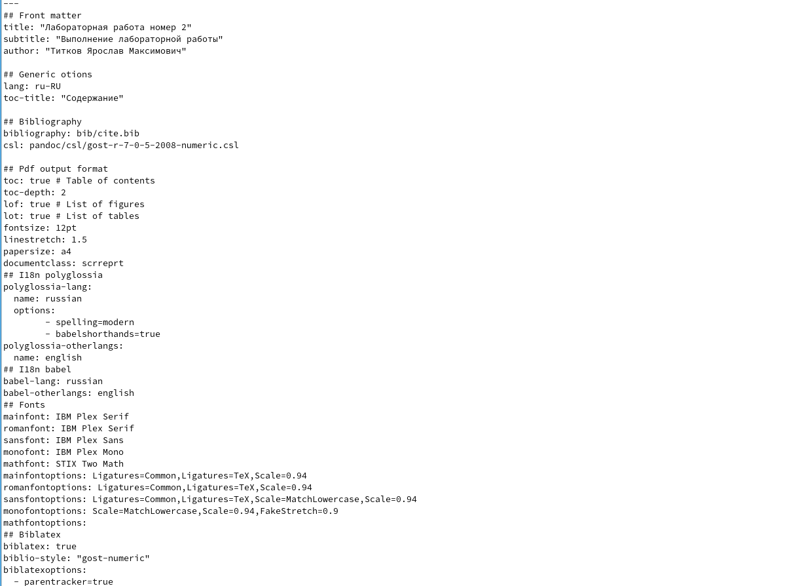
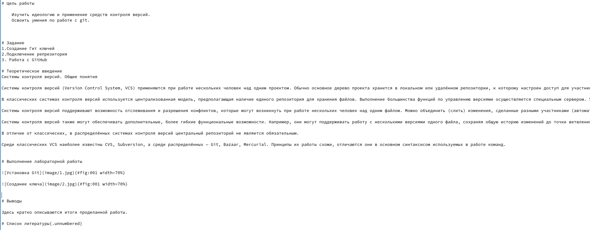
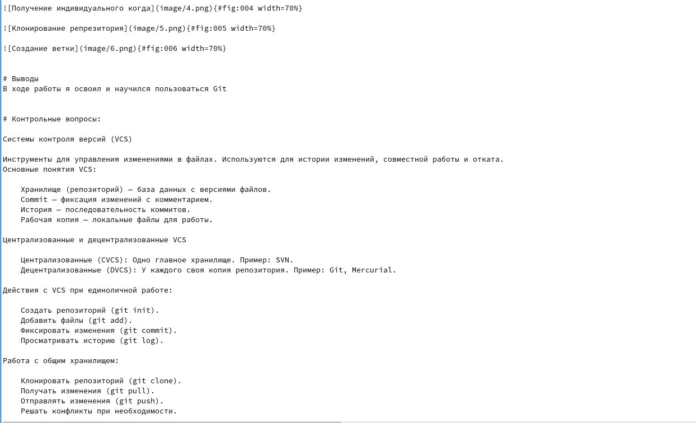
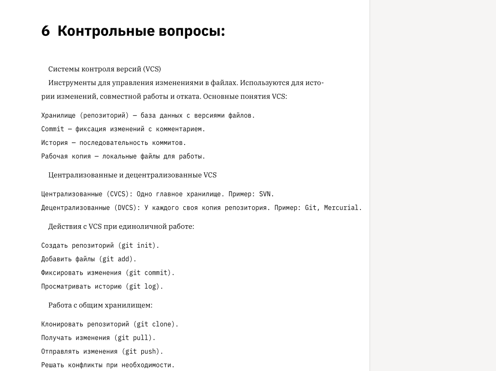

---
## Front matter
lang: ru-RU
title: Лабораторная работа №3
subtitle: Markdown
author:
  - Титков Ярослав Максимович
institute:
  - Российский университет дружбы народов, Москва, Россия
  
## i18n babel
babel-lang: russian
babel-otherlangs: english

## Formatting pdf
toc: false
toc-title: Содержание
slide_level: 2
aspectratio: 169
section-titles: true
theme: metropolis
header-includes:
 - \metroset{progressbar=frametitle,sectionpage=progressbar,numbering=fraction}
---

## Цель работы

Научиться оформлять отчёты с помощью легковесного языка разметки Markdown

## Задание
– Сделать отчёт по предыдущей лабораторной работе в формате Markdown.
– В качестве отчёта просьба предоставить отчёты в 3 форматах: pdf, docx и md (в архиве,
поскольку он должен содержать скриншоты, Makefile и т.д.)

## Мы открыли файл Markdown, чтобы начать его заполнять,офрмили титульный лист

{ #fig:001 width=70% }

## Затем мы начали прикреплять скрины, отвечающие за выполнение нашей работы

{ #fig:002 width=70% }

## После этого оформили вывод и ответили на контрольные вопросы по прошлой лабораторной работе 

{ #fig:003 width=70% }

## Скоомпелировав файлы мы открыли наш pdf файл и проверили как все работает

{ #fig:004 width=70% }

## В ходе работы я убедился, что все скрины стоят правильно и все ответы присутствуют 

{ #fig:005 width=70% }

## Вывод

Я научился оформлять отчёты с помощью языка Markdown

