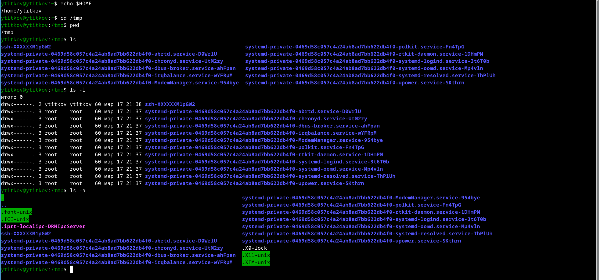
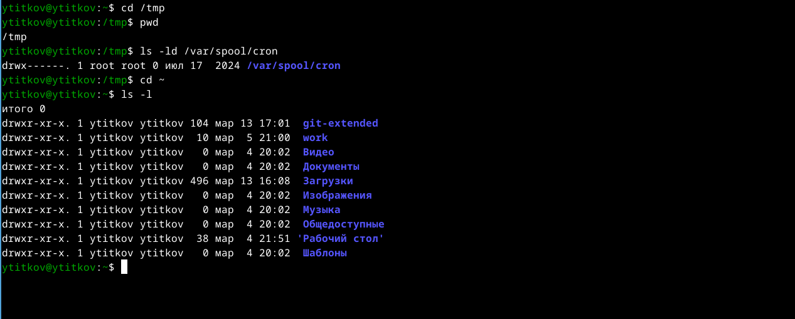
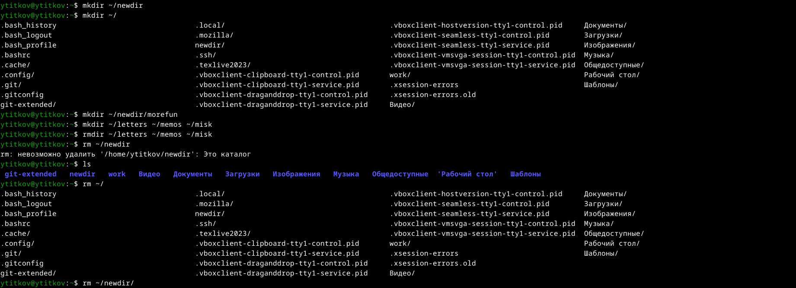
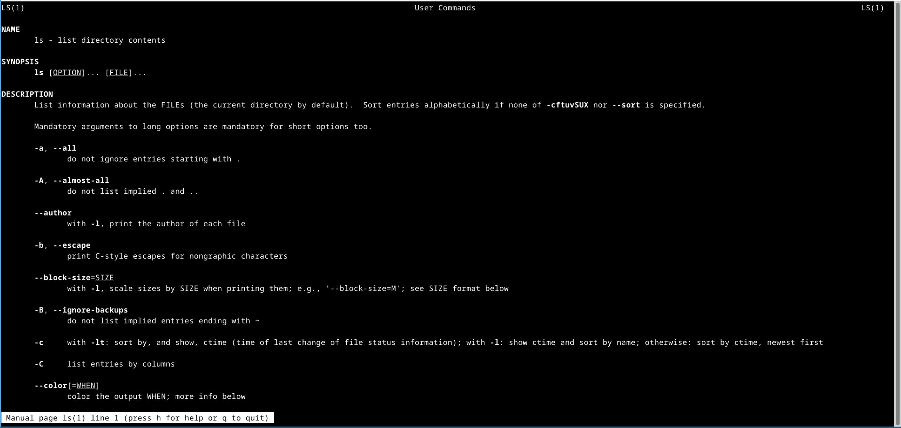
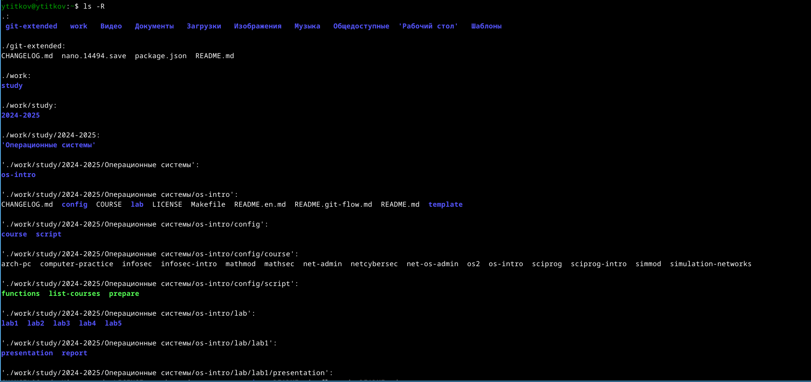
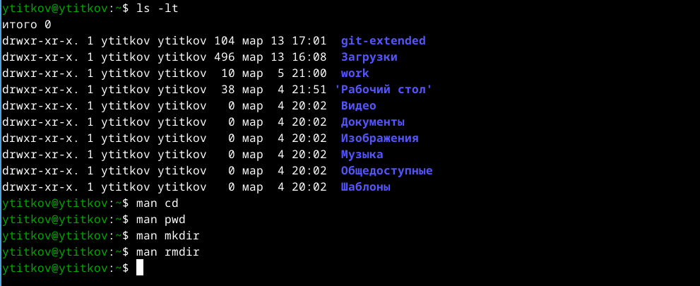
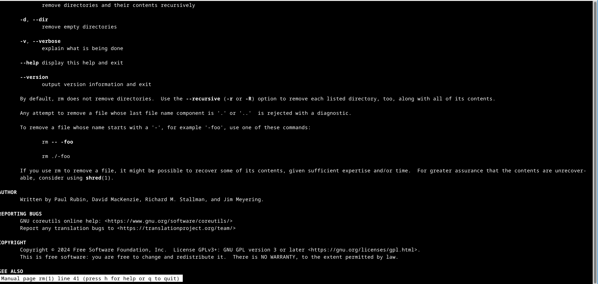
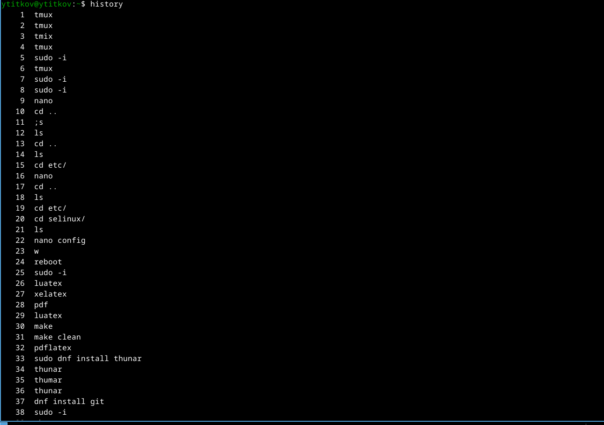
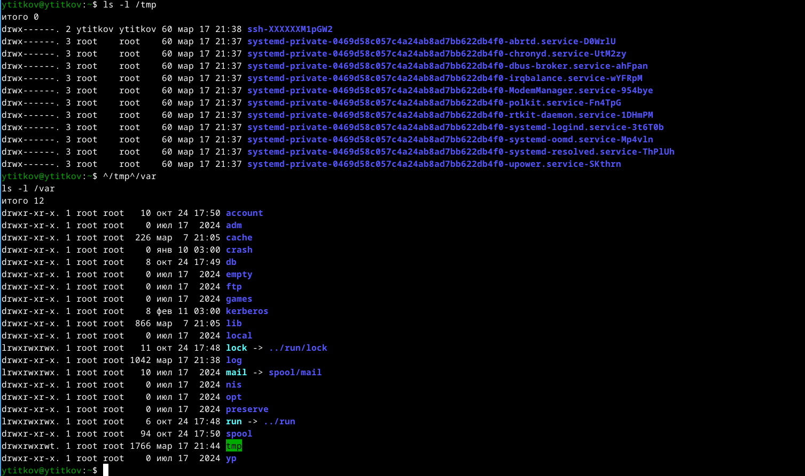

---
## Front matter
lang: ru-RU
title: Лабораторная работа №6
subtitle: Основы интерфейса взаимодействия пользователя с системой Unix на уровне командной строки
author:
  - Титков Ярослав Максимович
institute:
  - Российский университет дружбы народов, Москва, Россия

## i18n babel
babel-lang: russian
babel-otherlangs: english

## Formatting pdf
toc: false
toc-title: Содержание
slide_level: 2
aspectratio: 169
section-titles: true
theme: metropolis
header-includes:
  - \metroset{progressbar=frametitle,sectionpage=progressbar,numbering=fraction}
---

## Цель работы

Приобретение практических навыков взаимодействия пользователя с системой посредством командной строки.

## Задание

1. Определить полное имя домашнего каталога. Далее относительно этого каталога будут выполняться последующие упражнения.
2. Выполнить предложенные упражнения.

## Мы определили имя нашего домашнего каталога

{#fig:001 width=70%}

## Проверили наличие каталога cron

{#fig:002 width=70%}

## Работаем с каталогом

{#fig:003 width=70%}

## Работа с опцией ls

{#fig:004 width=70%}

{#fig:005 width=70%}

{#fig:006 width=70%}

## Работа с командами man и history

{#fig:007 width=70%}

{#fig:008 width=70%}

{#fig:009 width=70%}

## Вывод

В ходе лабораторной работы я приобрел практические навыки взаимодействия пользователя с системой посредством командной строки.