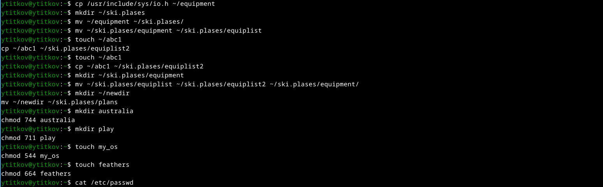
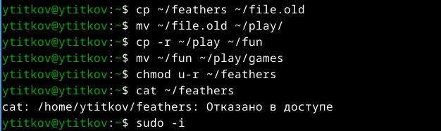

---
## Front matter
lang: ru-RU
title: Лабораторная работа №7
subtitle: Анализ файловой системы Linux. Команды для работы с файлами и каталогами
author: 
  - Титков Ярослав Максимович
institute: 
  - Российский университет дружбы народов, Москва, Россия
date: \today

## i18n babel
babel-lang: russian
babel-otherlangs: english

## Formatting pdf
toc: false
toc-title: Содержание
slide_level: 2
aspectratio: 169
section-titles: true
theme: metropolis
header-includes:
  - \metroset{progressbar=frametitle,sectionpage=progressbar,numbering=fraction}
---

## Цель работы
Ознакомление с файловой системой Linux, её структурой, именами и содержанием
каталогов. Приобретение практических навыков по применению команд для работы
с файлами и каталогами, по управлению процессами (и работами), по проверке использования диска и обслуживанию файловой системы.

## Задание
1. Ознакомиться с файловой системой Linux
2. Изучить команды для работы с файлами и каталогами
3. Выполнить практические задания

## Ход работы

### 1. Команды для работы с файловой системой

{#fig:001 width=70%}

### 2. Основные команды

{#fig:002 width=70%}

## Выводы
В ходе выполнения лабораторной работы я:
1. Ознакомился с файловой системой Linux
2. Изучил основные команды для работы с файлами и каталогами
3. Приобрел практические навыки работы в командной строке
4. Научился проверять использование диска и обслуживать файловую систему