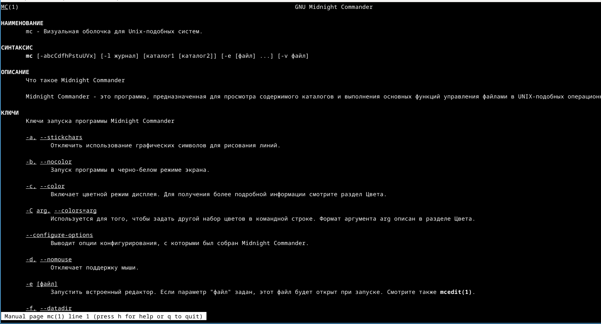
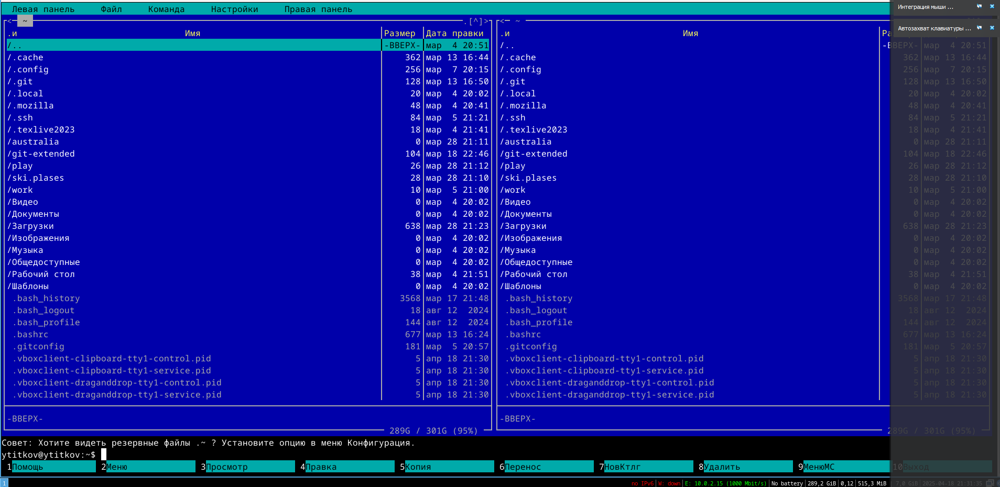
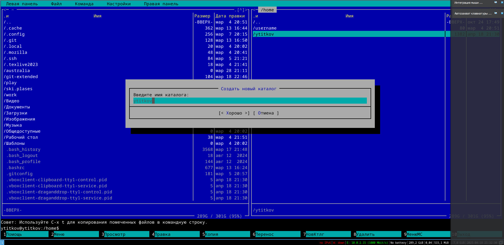
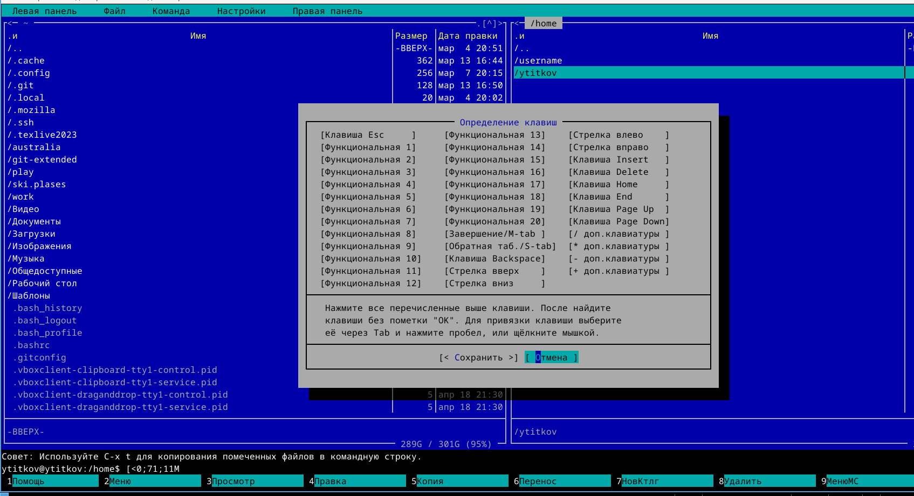
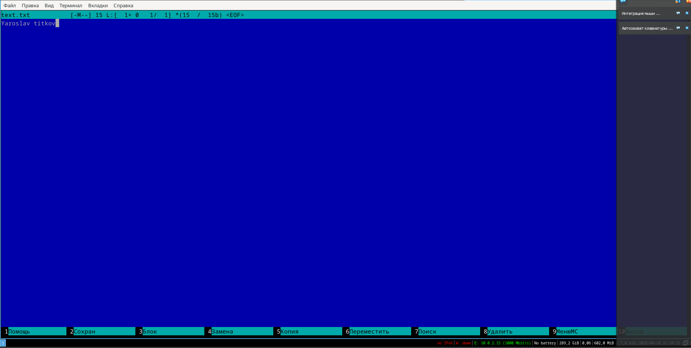

---
## Front matter
lang: ru-RU
title: Лабораторная работа №9
subtitle: "Командная оболочка Midnight
Commander"
author: 
  - Титков Ярослав Максимович
institute: 
  - Российский университет дружбы народов, Москва, Россия
date: \today

## i18n babel
babel-lang: russian
babel-otherlangs: english

## Formatting pdf
toc: false
toc-title: Содержание
slide_level: 2
aspectratio: 169
section-titles: true
theme: metropolis
header-includes:
  - \metroset{progressbar=frametitle,sectionpage=progressbar,numbering=fraction}
---

## Цель работы
Ознакомление с файловой системой Linux, её структурой, именами и содержанием
каталогов. Приобретение практических навыков по применению команд для работы
с файлами и каталогами, по управлению процессами (и работами), по проверке использования диска и обслуживанию файловой системы.

## Задание
1.Выполнить задания по работе с mc

2.Познакомиться с встроенным редактором mc

## 1. Работа с mc

{#fig:001 width=70%}

## 2. Изучение редактора

{#fig:002 width=70%}

## 3. Работа с редактором mc, создание файлов.

{#fig:003 width=70%}

## 4. Изменение настроек редактора 

{#fig:004 width=70%}

## 4. Работа с самим текстовым редактором 

{#fig:005 width=70%}

## Выводы
В ходе лабораторной работы, Я освоил основные возможности командной оболочки Midnight Commander. Приоб-
рел навыки практической работы по просмотру каталогов и файлов; манипуляций
с ними.
