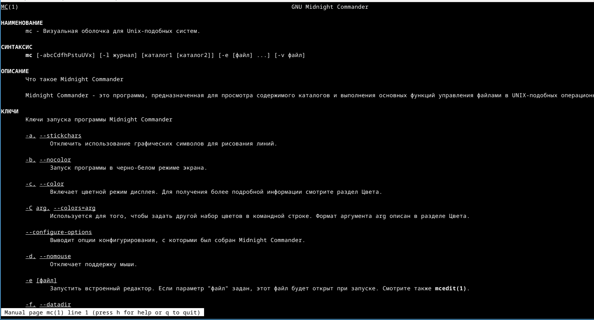
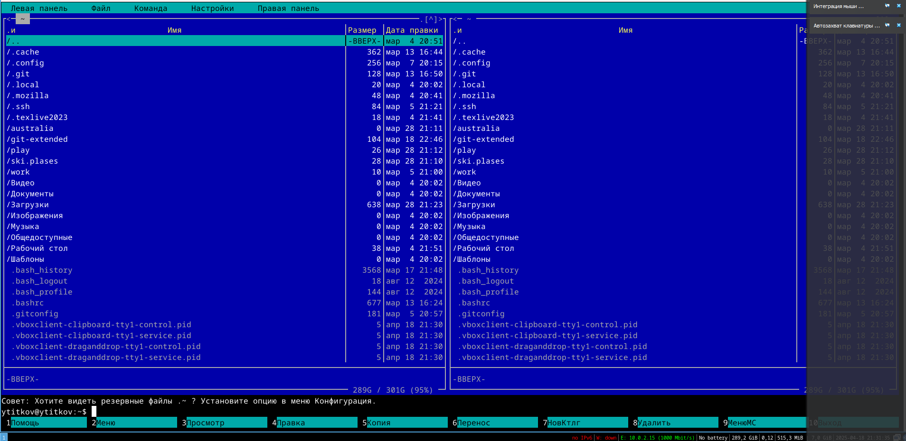
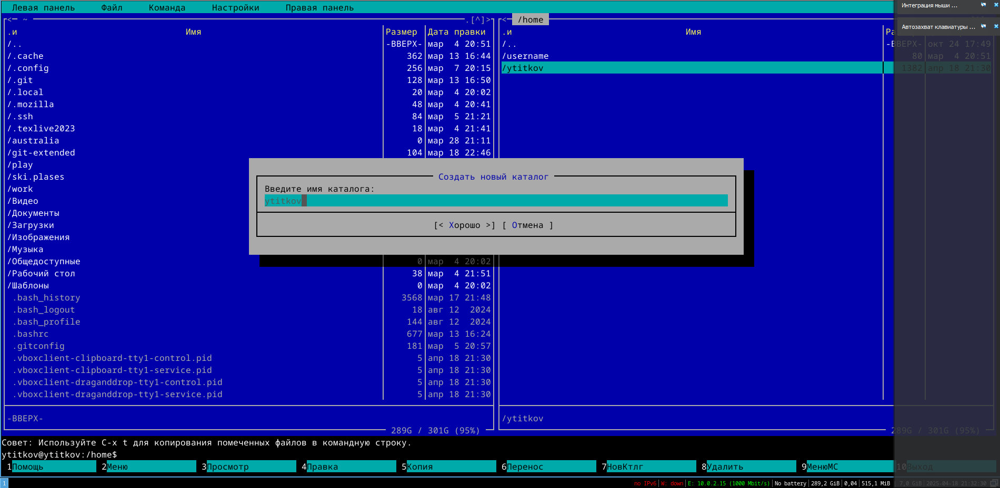
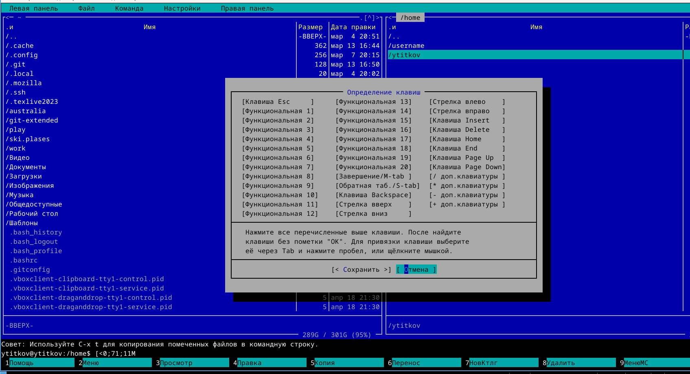
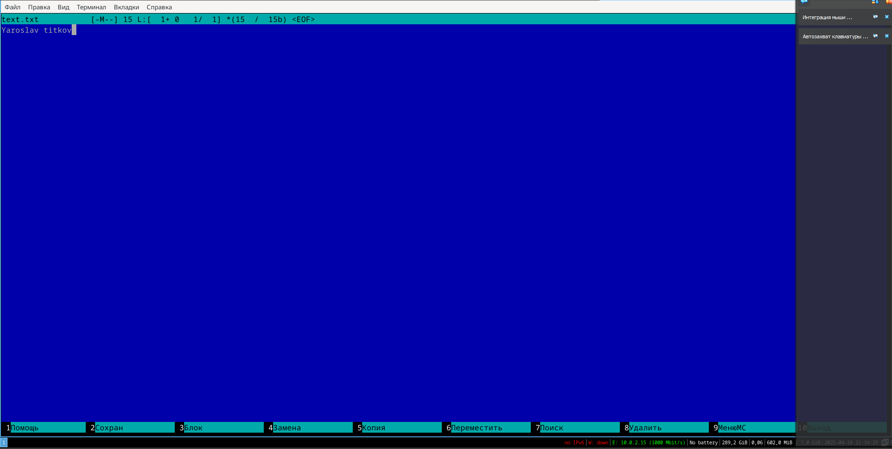

---
## Front matter
title: "Лабораторная работа номер 9"
subtitle: "Командная оболочка Midnight
Commander"
author: "Титков Ярослав Максимович"

## Generic otions
lang: ru-RU
toc-title: "Содержание"

## Bibliography
bibliography: bib/cite.bib
csl: pandoc/csl/gost-r-7-0-5-2008-numeric.csl

## Pdf output format
toc: true # Table of contents
toc-depth: 2
lof: true # List of figures
lot: true # List of tables
fontsize: 12pt
linestretch: 1.5
papersize: a4
documentclass: scrreprt
## I18n polyglossia
polyglossia-lang:
  name: russian
  options:
	- spelling=modern
	- babelshorthands=true
polyglossia-otherlangs:
  name: english
## I18n babel
babel-lang: russian
babel-otherlangs: english
## Fonts
mainfont: IBM Plex Serif
romanfont: IBM Plex Serif
sansfont: IBM Plex Sans
monofont: IBM Plex Mono
mathfont: STIX Two Math
mainfontoptions: Ligatures=Common,Ligatures=TeX,Scale=0.94
romanfontoptions: Ligatures=Common,Ligatures=TeX,Scale=0.94
sansfontoptions: Ligatures=Common,Ligatures=TeX,Scale=MatchLowercase,Scale=0.94
monofontoptions: Scale=MatchLowercase,Scale=0.94,FakeStretch=0.9
mathfontoptions:
## Biblatex
biblatex: true
biblio-style: "gost-numeric"
biblatexoptions:
  - parentracker=true
  - backend=biber
  - hyperref=auto
  - language=auto
  - autolang=other*
  - citestyle=gost-numeric
## Pandoc-crossref LaTeX customization
figureTitle: "Рис."
tableTitle: "Таблица"
listingTitle: "Листинг"
lofTitle: "Список иллюстраций"
lotTitle: "Список таблиц"
lolTitle: "Листинги"
## Misc options
indent: true
header-includes:
  - \usepackage{indentfirst}
  - \usepackage{float} # keep figures where there are in the text
  - \floatplacement{figure}{H} # keep figures where there are in the text
---

# Цель работы
Освоение основных возможностей командной оболочки Midnight Commander. Приоб-
ретение навыков практической работы по просмотру каталогов и файлов; манипуляций
с ними.

# Задание
Выполнить задания по работе с mc
Познакомиться с встроенным редактором mc

# Выполнение лабораторной работы

{#fig:001 width=70%}

{#fig:002 width=70%}

{#fig:003 width=70%}

{#fig:004 width=70%}

{#fig:005 width=70%}

# Выводы
В ходе лабораторной работы, Я освоил основные возможности командной оболочки Midnight Commander. Приоб-
рел навыки практической работы по просмотру каталогов и файлов; манипуляций
с ними.

# Контрольные вопросы
1. Режимы работы mc:  
   - Файловый (две панели, навигация, управление файлами).  
   - Встроенный просмотр (F3) и редактирование (F4).  

2. Операции с файлами:  
   - Копирование (F5, `cp`).  
   - Перемещение (F6, `mv`).  
   - Удаление (F8, `rm`).  
   - Просмотр (F3, `less`).  

3. Структура меню панели (левой/правой):  
   - Быстрый просмотр, информация, дерево каталогов, режим сортировки.  

4. Меню "Файл":  
   - Просмотр, редактирование, копирование, переименование, права доступа.  

5. Меню "Команда":  
   - Поиск файлов, сравнение каталогов, ссылки, терминал.  

6. Меню "Настройки":  
   - Конфигурация, внешний вид, настройки панелей.  

7. Встроенные команды mc:  
   - `cd`, `chmod`, `mkdir`, `find` (аналоги shell, но через интерфейс).  

8. Команды встроенного редактора:  
   - Сохранение (F2), поиск (F7), замена, отмена.  

9. Пользовательские меню:  
   - Редактирование `~/.config/mc/menu` для своих пунктов.  

10. Пользовательские действия:  
    - Настройка горячих клавиш или команд через "Расширения файлов".

