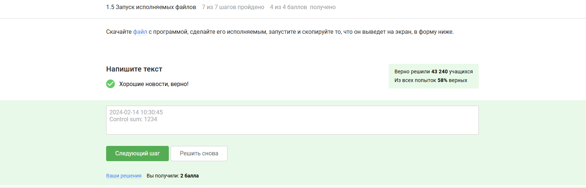

---
## Front matter
lang: ru-RU
title: "Внешний курс. Раздел - 1"
subtitle: "Выполнение внешнего курса. Основы Linux. Раздел 1"
author: 
  - Титков Ярослав Максимович
institute: 
  - Российский университет дружбы народов, Москва, Россия
date: \today

## Formatting pdf
toc: false
toc-title: Содержание
slide_level: 2
aspectratio: 169
section-titles: true
theme: metropolis
header-includes:
  - \metroset{progressbar=frametitle,sectionpage=progressbar,numbering=fraction}
---

## Цель работы

Ознакомиться с системой Linux.

## Задание

Выполнить все тестовые задания.

## 1.1 Базовые операции

## 1.1 Базовые операции
{#fig:001 width=70%}

## 1.1 Настройка окружения
{#fig:002 width=70%}

Для данного раздела пояснения не требуются.

## 1.2 Использование ОС и виртуальных машин

## 1.2 Использование операционных систем
{#fig:003 width=70%}

Ответ соответствует реальному использованию ОС.

## 1.2 Определение виртуальной машины
{#fig:004 width=70%}

Это точное определение виртуальной машины.

## 1.2 Подтверждение запуска Linux
{#fig:005 width=70%}

Linux успешно запустился — шаги выполнены корректно.

## 1.3 Работа с пакетами и обновлениями

## 1.3 Форматы пакетов
{#fig:006 width=70%}

В Ubuntu используются .deb пакеты.

## 1.3 Информация о разработчике
{#fig:007 width=70%}

Фамилия подтверждает выполнение задания.

## 1.3 Назначение Update Manager
{#fig:008 width=70%}

Update Manager предназначен для обновлений.

## 1.4 Командная строка

## 1.4 Термины для командной строки
{#fig:009 width=70%}

Только "Терминал" и "Командная строка" корректны.

## 1.4 Команда pwd
{#fig:010 width=70%}

Команда `pwd` выводит текущую директорию.

## 1.4 Комбинация опций ls
{#fig:011 width=70%}

-A, -h, -l дают подробный человеко-читаемый список.

## 1.4 Навигация по директориям
{#fig:012 width=70%}

Относительный путь к `Downloads`.

## 1.4 Рекурсивное удаление
{#fig:013 width=70%}

`rm -r` — для удаления директории с содержимым.

## 1.5 Управление процессами

## 1.5 Работа процессов
{#fig:014 width=70%}

Процессы продолжают работу после `exit`.

## 1.5 Управление процессами
{#fig:015 width=70%}

`Ctrl+Z`, затем `bg` — перевод в фон.

## 1.5 Вывод исполняемого файла
{#fig:016 width=70%}

Результат копируется напрямую.

## 1.6 Потоки и перенаправление

## 1.6 Поток ошибок stderr
{#fig:017 width=70%}

Ошибки выводятся в терминал по умолчанию.

## 1.6 Перенаправление stderr
{#fig:018 width=70%}

`2>` — перенаправление ошибок в файл.

## 1.6 Ошибки в конвейере
{#fig:019 width=70%}

Ошибки в пайпах отображаются, если не перенаправлены.

## 1.7 Загрузка файлов

## 1.7 Опции wget -O и -P
{#fig:020 width=70%}

-O задаёт имя, -P — директорию.

## 1.7 Тихий режим wget
{#fig:021 width=70%}

-q отключает вывод.

## 1.7 Фильтрация по расширению
{#fig:022 width=70%}

-A jpg фильтрует по расширению.

## 1.8 Архивация

## 1.8 Сравнение gzip и zip
{#fig:023 width=70%}

gzip удаляет оригинал, zip — нет.

## 1.8 Архивация директорий
{#fig:024 width=70%}

tar и zip архивируют директории.

## 1.8 Создание tar.bz2
{#fig:025 width=70%}

Опции `cjf` — для создания .tar.bz2.

## 1.9 Работа с grep и масками

## 1.9 Маски файлов
{#fig:026 width=70%}

Маски корректны и чувствительны к регистру.

## 1.9 Чувствительный поиск grep
{#fig:027 width=70%}

Регистр имеет значение.

## 1.9 Перенаправление вывода grep
{#fig:028 width=70%}

Результат записан в файл.

## Выводы

Я ознакомился и прошёл 1 раздел курса на Степике.

