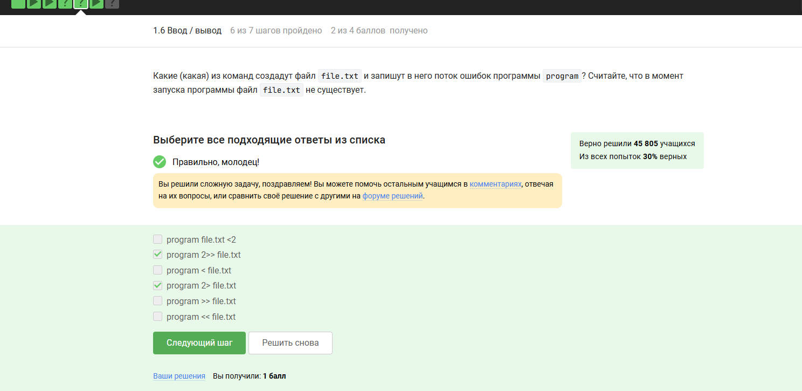

---
## Front matter
title: "Внешний курс. Раздел - 1"
subtitle: "Выполнение внешнего курса. Основы Linux. Раздел 1"
author: "Титков Ярослав Максимович"

## Generic options
lang: ru-RU
toc-title: "Содержание"

## Bibliography
bibliography: bib/cite.bib
csl: pandoc/csl/gost-r-7-0-5-2008-numeric.csl

## Pdf output format
toc: true
toc-depth: 2
lof: true
lot: true
fontsize: 12pt
linestretch: 1.5
papersize: a4
documentclass: scrreprt

## I18n polyglossia
polyglossia-lang:
  name: russian
  options:
    - spelling=modern
    - babelshorthands=true
polyglossia-otherlangs:
  name: english

## Fonts
mainfont: IBM Plex Serif
romanfont: IBM Plex Serif
sansfont: IBM Plex Sans
monofont: IBM Plex Mono
mainfontoptions: Ligatures=Common,Ligatures=TeX,Scale=0.94
monofontoptions: Scale=MatchLowercase,Scale=0.94,FakeStretch=0.9

## Pandoc-crossref settings
figureTitle: "Рис."
tableTitle: "Таблица"
lofTitle: "Список иллюстраций"
lotTitle: "Список таблиц"

header-includes:
  - \usepackage{indentfirst}
  - \usepackage{float}
  - \floatplacement{figure}{H}
  - \usepackage{graphicx}
  - \setkeys{Gin}{width=0.7\linewidth}
---

# Цель работы

Ознакомиться с системой Linux.

# Задание

Выполнить все тестовые задания.

# Выполнение лабораторной работы

## Раздел 1.1

{#fig:001}

{#fig:002}

Для данного раздела пояснения не требуются.

## Раздел 1.2

{#fig:003}

Ответ соответствует реальному использованию ОС. Даже в курсе по Linux пользователи могут работать на Windows (например, через виртуальную машину).

{#fig:004}

Это точное определение виртуальной машины. Остальные варианты абсурдны ("Автомобиль будущего") или неверны ("Вид ОС").

{#fig:005}

Потому что Linux успешно запустился, что подтверждает корректность выполненных шагов.

## Раздел 1.3

{#fig:006}

В Ubuntu пакеты имеют расширение .deb. .exe — для Windows, .dmg — для macOS, .txt и .ubuntu не относятся к пакетам.

{#fig:007}

Фамилия из вкладки Authors в VLC подтверждает выполнение задания. Важно было указать именно фамилию (last name), что и сделано.

{#fig:008}

Update Manager предназначен именно для обновлений, а не для установки/удаления программ (это задачи Software Center).

## Раздел 1.4

{#fig:009}

Оба термина являются синонимами "командной строки" в Linux. "Ассоль" и "Термин" — случайные слова, не связанные с темой.

{#fig:010}

Команда pwd (в нижнем регистре) — стандартная в Linux для вывода текущей директории. Регистр в командах имеет значение, поэтому PWD и Pwd не работают.

{#fig:011}

Опции -A, -h, и -l комбинируются для вывода скрытых файлов, человеко-читаемых размеров и подробного списка.

{#fig:012}

Команда использует относительный путь из текущей директории (/home/b1/bocuments), чтобы перейти в Downloads внутри домашней директории (/home/b1).

{#fig:013}

Команда rm -r рекурсивно удаляет директории и их содержимое, что соответствует заданию.

## Раздел 1.5

{#fig:014}

Команда exit закрывает терминал, но Firefox, запущенный в фоне, останется работать.

{#fig:015}

Комбинация Ctrl+Z приостанавливает процесс, а bg перемещает его в фон, что эквивалентно запуску с &.

{#fig:016}

Текст скопирован напрямую из результата работы исполняемого файла, как требовалось.

## Раздел 1.6

{#fig:017}

Поток ошибок (stderr) по умолчанию выводится в терминал, если не перенаправлен.

{#fig:018}

Оператор 2> перенаправляет поток ошибок в файл, создавая его при необходимости.

{#fig:019}

Сообщения об ошибках в конвейере по умолчанию выводятся в терминал, если не перенаправлены.

## Раздел 1.7

{#fig:020}

Опция -O указывает имя файла (1.jpg), а -P — директорию для сохранения (`Pictures`).

{#fig:021}

Опция -q подавляет вывод сообщений wget, что соответствует условию.

{#fig:022}

Опция -A jpg фильтрует загрузку только файлов с расширением .jpg.

## Раздел 1.8

{#fig:023}

По умолчанию gzip удаляет исходный файл после сжатия/распаковки, в отличие от zip.

{#fig:024}

Только tar и zip поддерживают упаковку директорий. gzip работает с отдельными файлами.

{#fig:025}

Опции c (create), j (bzip2), f (file) нужны для создания архива .tar.bz2.

## Раздел 1.9

{#fig:026}

Маски соответствуют имени файла (Alexey.jpg) и его расширению, включая вариации регистра.

{#fig:027}

Команда grep чувствительна к регистру, поэтому выбраны только строки с "world".

{#fig:028}

Результат работы grep "love" с перенаправлением вывода в файл, как требовалось.

# Выводы

Я ознакомился и прошёл 1 раздел курса на Степике.

