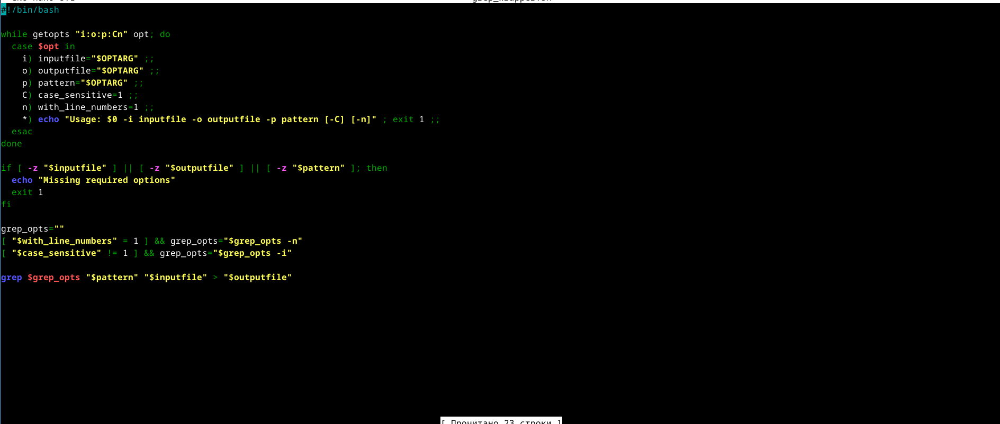
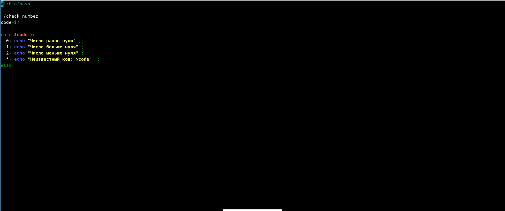

## Цель

Изучить расширенные аспекты работы в Linux, включая работу с удалёнными серверами, передачу файлов, управление процессами и использование инструментов командной строки.

## Задание

Выполнить задания, представленные во втором разделе курса.

## Удалённые серверы

{#fig:001 width=70%}  
Выбраны все варианты, потому что удаленный сервер подходит для хранения данных (общедоступных, больших, конфиденциальных) и выполнения сложных вычислений.

## Передача открытого ключа

{#fig:002 width=70%}  
Выбран `id_rsa.pub`, так как это открытый ключ, который безопасно передавать.

## scp -r

{#fig:003 width=70%}  
Выбран `scp -r steplc username@server:/`, так как эта команда рекурсивно копирует папку с содержимым.

## apt-get update

{#fig:004 width=70%}  
Выбран `sudo apt-get update`, так как это обновляет список пакетов.

## FileZilla

{#fig:005 width=70%}  
Выбраны варианты для просмотра директорий и копирования файлов, так как Filezilla предназначен для этих задач.

## Графические приложения

{#fig:006 width=70%}  
Выбраны варианты настройки сервера для вывода на экран и проверки терминальной версии программы.

## man и --help

{#fig:007 width=70%}  
Выбраны `man program` и `program --help` — стандартные способы получения справки.

## FastQC и fastq

{#fig:008 width=70%}  
Выбраны варианты barn, sarn и fastq, так как они соответствуют формату данных для FastQC.

## ClustalW -align

{#fig:009 width=70%}  
Введена команда `clustalw -align test.fasta`, так как она явно указывает на множественное выравнивание.

## jobs и завершение/приостановка

{#fig:010 width=70%}  
Ctrl+C завершает программу, Ctrl+Z — приостанавливает.

## PID: jobs, ps, top

{#fig:011 width=70%}  
У всех команд разные идентификаторы: jobs — job ID, ps — PID, top — динамически обновляется.

## SIGKILL (kill -9)

{#fig:012 width=70%}  
`kill -9` (SIGKILL) мгновенно завершает процесс, включая остановленные.

## SIGTERM

{#fig:013 width=70%}  
`kill` без параметров отправляет SIGTERM — корректное завершение процесса.

## SIGSTOP и CPU

{#fig:014 width=70%}  
Остановленный процесс не использует CPU: 0%.

## Память при остановке

{#fig:015 width=70%}  
Процесс сохраняет потребляемую память на момент остановки.

## Завершение потока

{#fig:016 width=70%}  
Завершение — через Ctrl+C.

## Параллелизм bowtie2

{#fig:017 width=70%}  
`bowtie2` поддерживает многопоточность, `bowtie2-build` — нет.

## Вывод в файл

{#fig:018 width=70%}  
Статистика записана в `bowtie.log`, подтверждая работу в многопоточном режиме.

## fg и вкладки

{#fig:019 width=70%}  
`fg` не работает в другой вкладке: терминал сообщит об ошибке.

## exit в tmux

{#fig:020 width=70%}  
Закрытие последней вкладки завершает сессию `tmux`.

## Закрытие терминала и trnux

{#fig:021 width=70%}  
После закрытия терминала процессы в `tmux/trnux` продолжают работать.

## Процессы и вкладки

{#fig:022 width=70%}  
Принудительное закрытие вкладки убивает процессы в ней.

## Переименование вкладки

{#fig:023 width=70%}  
Переименование вкладки в `tmux`: Ctrl+B, затем `,`.

## Выводы

Я прошёл и изучил второй раздел курса по Linux на платформе Stepik.  
Изучены: удалённые серверы, передача файлов, SSH, работа с процессами и сигналами, многопоточность, `tmux/trnux`, утилиты FastQC, bowtie2, ClustalW и др.
