# Цель работы

Изучить расширенные аспекты работы в Linux, включая работу с удалёнными серверами, передачу файлов, управление процессами и использование инструментов командной строки.

# Задание

Выполнить задания, представленные во втором разделе курса.

# Выполнение лабораторной работы

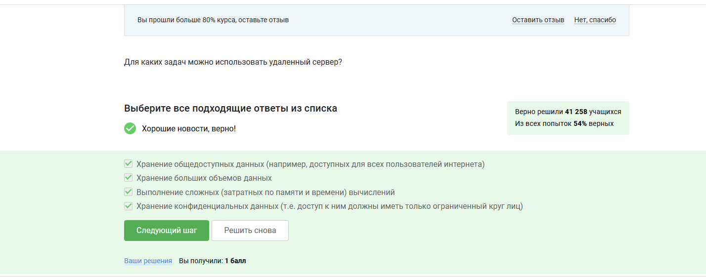{#fig:001}

Выбраны все варианты, потому что удаленный сервер подходит для хранения данных (общедоступных, больших, конфиденциальных) и выполнения сложных вычислений.

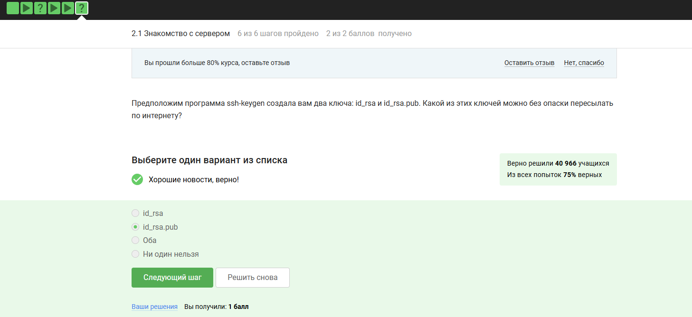{#fig:002}

Выбран id_rsa.pub, так как это открытый ключ, который безопасно передавать.

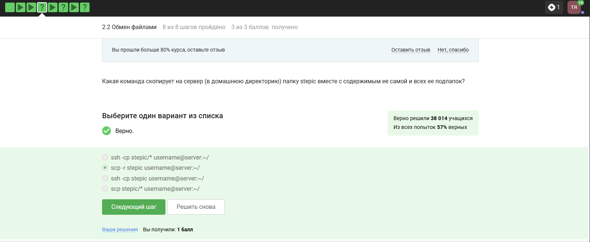{#fig:003}

Выбран scp -r steplc username@server:/, так как эта команда рекурсивно копирует папку с содержимым.

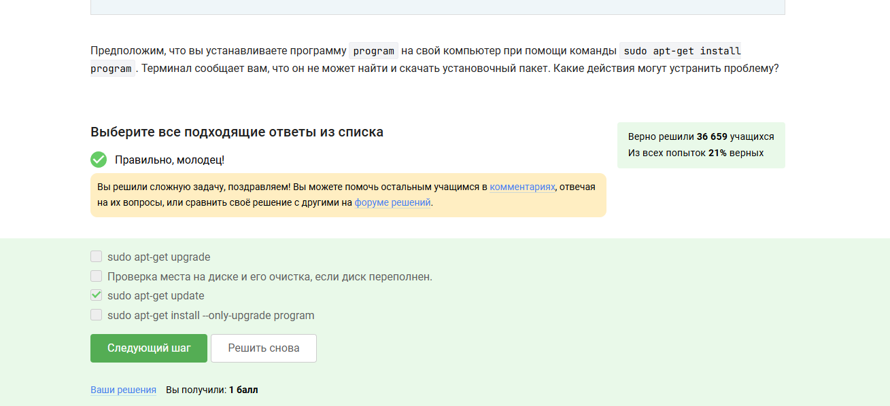{#fig:004}

Выбран sudo apt-get update, так как это обновляет список пакетов, что может решить проблему с установкой.

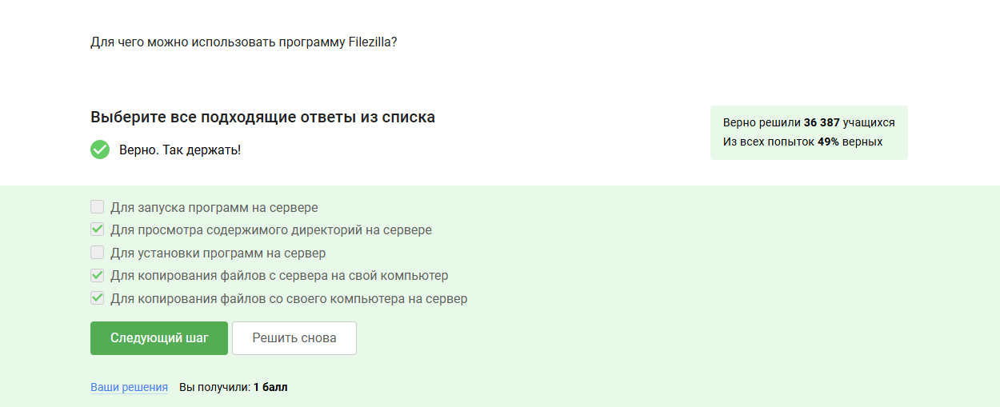{#fig:005}

Выбраны варианты для просмотра директорий и копирования файлов (на сервер и с сервера), так как Filezilla предназначен для этих задач.

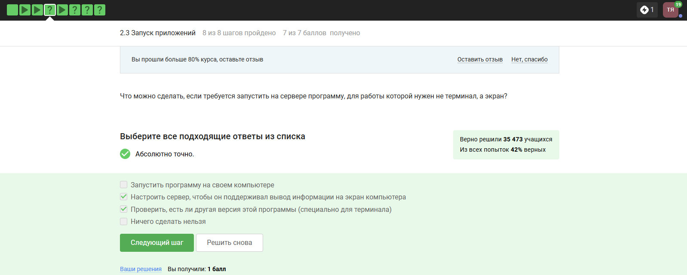{#fig:006}

Выбраны варианты настройки сервера для вывода на экран и проверки терминальной версии программы, так как это решает проблему.

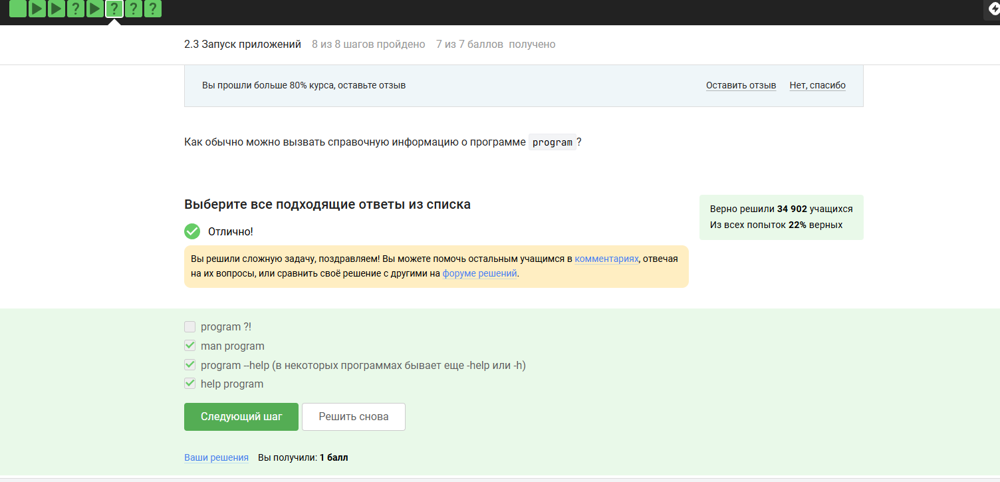{#fig:007}

Выбраны man program и program --help, так как это стандартные способы получения справки.

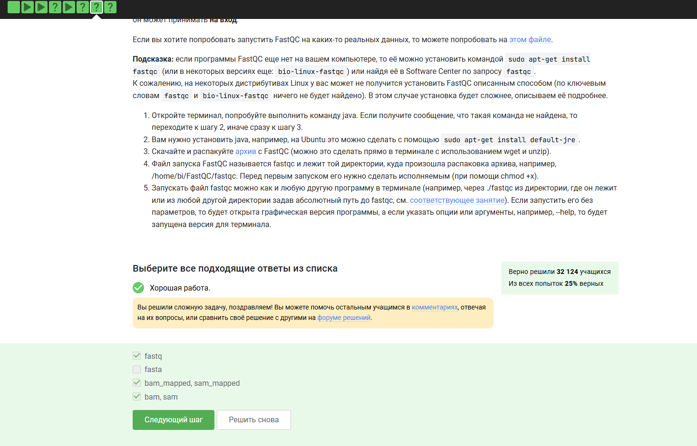{#fig:008}

Выбраны варианты barn, sarn и fastq, так как они соответствуют формату данных для FastQC.

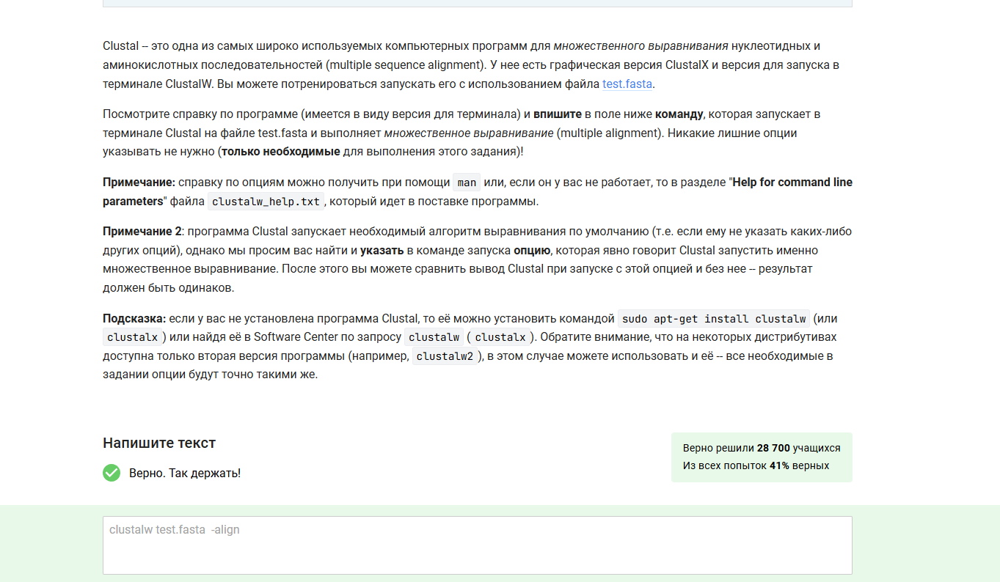{#fig:009}

Введена команда clustalw -align test.fasta, так как она явно указывает на множественное выравнивание.

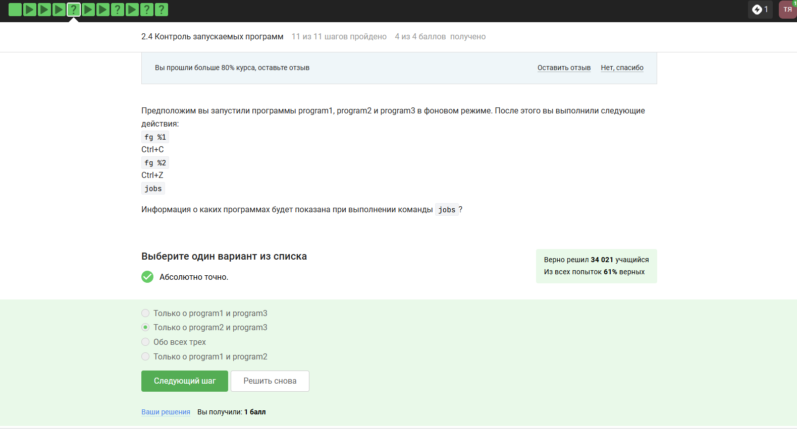{#fig:010}

Выбран вариант "Только о program1 и program3", так как Ctrl+C завершает программу, а Ctrl+Z приостанавливает, оставляя их в списке jobs.

{#fig:011}

Выбрано "У всех разные", так как jobs, top и ps используют разные идентификаторы: jobs — номер задания в оболочке, ps — PID, top — динамический список.

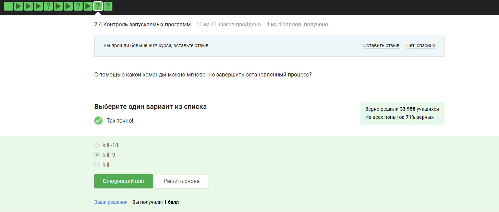{#fig:012}

Выбрано kill -9, так как это сигнал SIGKILL, мгновенно завершающий процесс, включая остановленные.

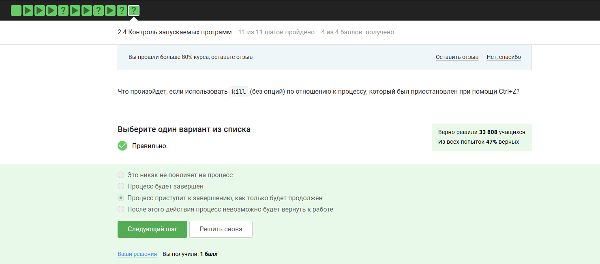{#fig:013}

Выбрано "Процесс будет завершен", так как kill без опций отправляет SIGTERM, который завершает процесс.

{#fig:014}

Выбрано "0% CPU", так как остановленный процесс (Ctrl+Z) не использует процессорное время.

{#fig:015}

Выбрано "Столько, сколько оно потребляло в момент остановки", так как память не освобождается при остановке.

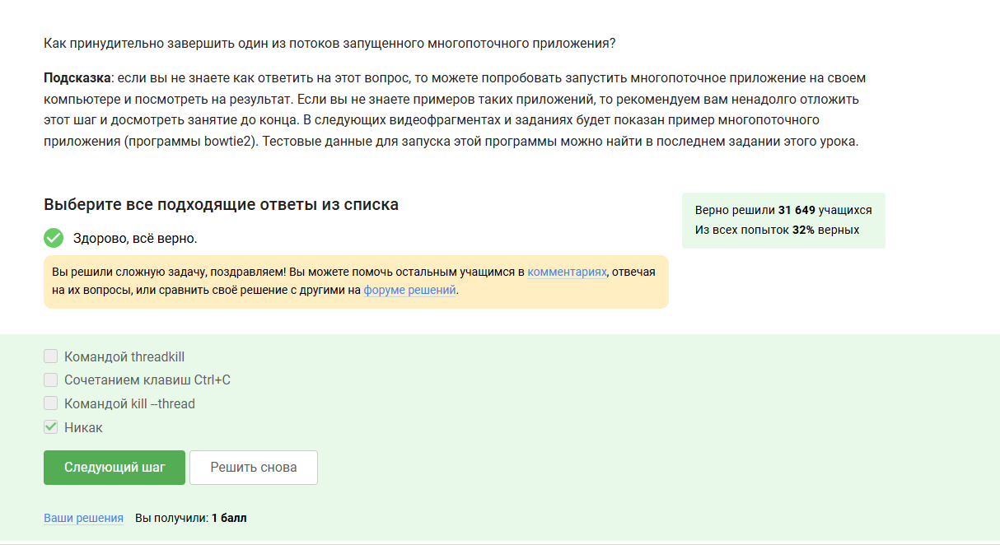{#fig:016}

Выбрано сочетание клавиш Ctrl+C, так как это стандартный способ принудительного завершения процессов в терминале.

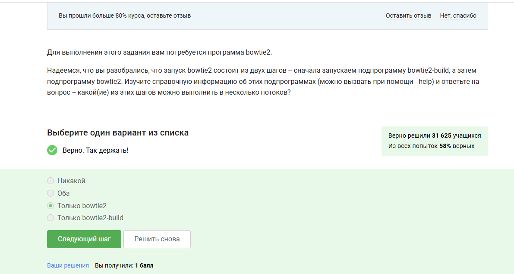{#fig:017}

Выбрано "Только bowtie2", так как bowtie2 поддерживает многопоточность, а bowtie2-build — нет.

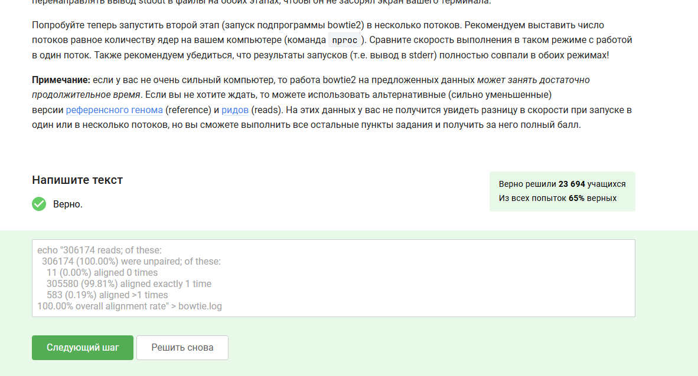{#fig:018}

Выполнено задание с выводом статистики в bowtie.log, подтверждающее корректность работы в многопоточном режиме.

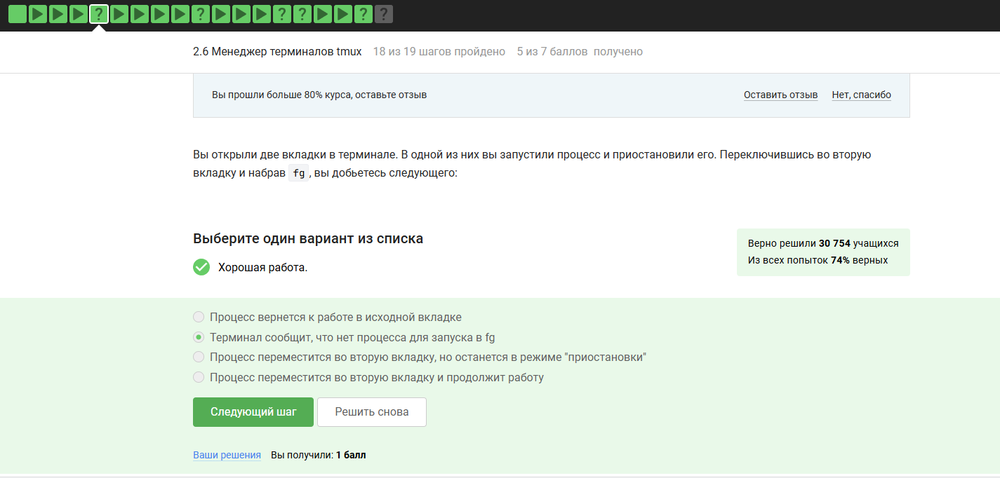{#fig:019}

Выбран вариант "Терминал сообщит, что нет процесса для запуска в fg", потому что команда fg работает только в текущей вкладке.

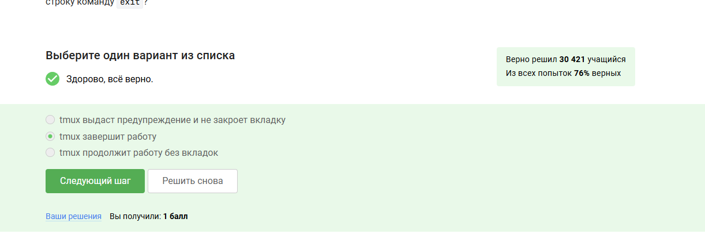{#fig:020}

Выбран вариант "tmux завершит работу", так как закрытие последней вкладки приводит к завершению сессии tmux.

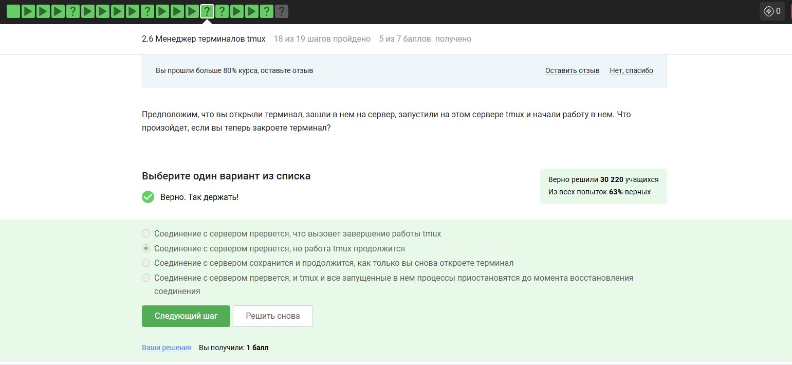{#fig:021}

Выбрано "Соединение с сервером прервется, но работа trnux продолжится", так как tmux/trnux работает независимо от терминала.

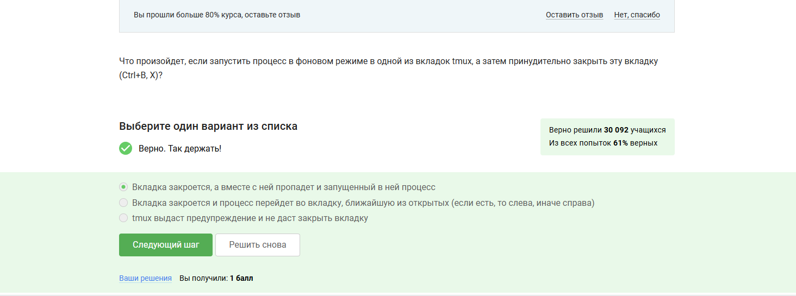{#fig:022}

Выбран вариант "Вкладка закроется, а вместе с ней пропадет и запущенный в ней процесс", так как принудительное закрытие вкладки в tmux убивает все процессы в ней.

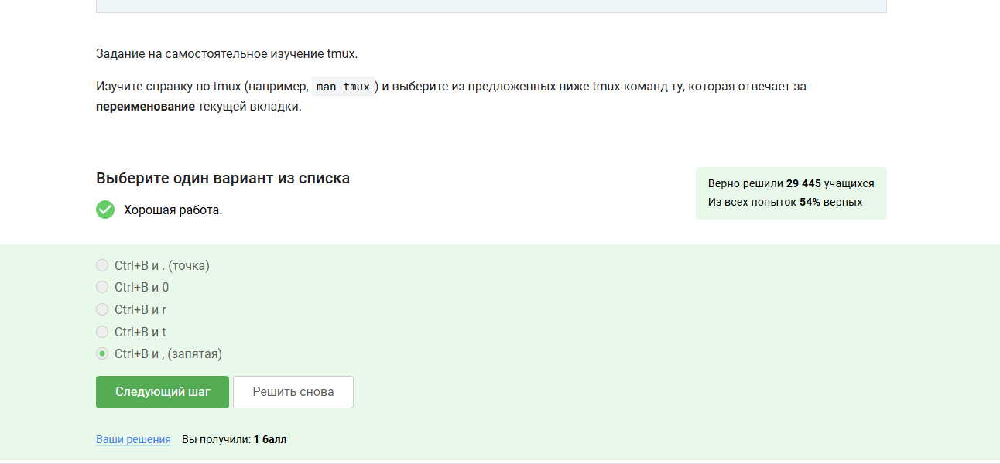{#fig:023}

Выбран вариант "Ctrl+B и , (запятая)", потому что эта комбинация в tmux отвечает за переименование текущей вкладки.

# Выводы

Я прошёл и изучил второй раздел курса по Linux на платформе Stepik.
