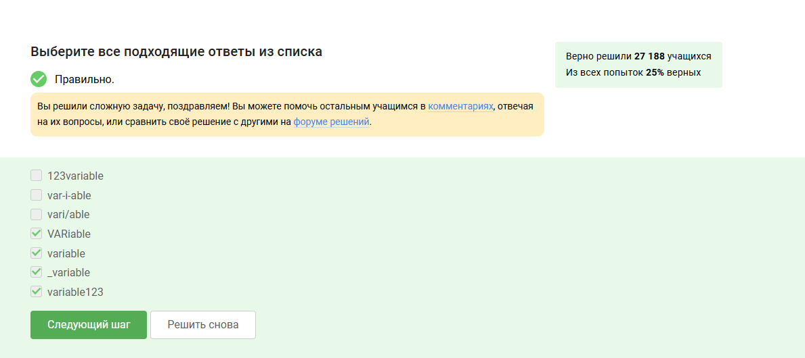

# Цель работы

Изучить раздел 3 курса Linux, включая дополнительные возможности командной строки, работу с архивами, конфигурационными файлами и сетевыми утилитами.

# Задание

Выполнить задания, представленные в третьем разделе курса.

# Выполнение лабораторной работы

{#fig:001}

Выбран вариант :q + Enter, так как это стандартная команда для выхода из Vim без сохранения.

{#fig:002}

Пропущено (нет выбранных вариантов).

{#fig:003}

Выбрана команда :%s/Windows/Linux, так как она заменяет первое вхождение "Windows" на "Linux" во всём файле.

{#fig:004}

Выбраны верные утверждения о режиме выделения в Vim (открывается на v, поддерживает команды d и y).

{#fig:005}

Выбран вариант "Только из набора C", так как история команд вложенных оболочек не сохраняется в родительской.

{#fig:006}

Выбран путь /home/bi/file1.txt, так как файл создаётся в этой директории до смены пути.

{#fig:007}

Выбраны корректные имена переменных (начинаются с буквы/подчёркивания, без спецсимволов).

{#fig:008}

Выбран вариант с выводом аргументов скрипта ($1 и $2), так как задача требует отображать переданные параметры в указанном формате.

{#fig:009}

Пропущено (нет выбранных вариантов).

{#fig:010}

Выбран вариант "Сначала two, потом four", так как условия elif и else обрабатываются последовательно.

{#fig:011}

Выбрал вариант с выводом количества студентов в зависимости от ввода, исправив синтаксические ошибки в условиях (например, -qt на -gt).

{#fig:012}

Ответ "5 раз 'start' и ни разу 'finish'" выбран, так как цикл выводит "start" 5 раз, но не достигает "finish" из-за условий.

{#fig:013}

Скрипт корректно определяет возрастные группы (child, youth, adult) и завершается при вводе пустого значения или нуля.

{#fig:014}

Выбраны варианты с корректным синтаксисом для операции let (например, let "a+=b" и let a=a+b).

{#fig:015}

Ответ "'pwd'" выбран, так как команда echo выводит текст в кавычках буквально, а не результат pwd.

{#fig:016}

Решение задачи с подсчётом, вероятно, связано с исправлением ошибок в логике или синтаксисе скрипта.

{#fig:017}

Исправлен алгоритм вычисления НОД (например, оператор % вместо $), чтобы он работал корректно.

{#fig:018}

Скрипт калькулятора исправлен: добавлены пропущенные кавычки и корректные операции (например, * вместо +).

{#fig:019}

Выбраны файлы, содержащие подстроку "star" в разных вариациях (регистр, символы).

{#fig:020}

Верно отмечено, что -path и -name могут давать одинаковый результат в некоторых случаях, но не всегда.

{#fig:021}

Только file2. Параметры -mindepth 2 -maxdepth 3 ограничивают поиск файлов file* на определённых уровнях вложенности.

{#fig:022}

grep -C 1 'word' file.txt > results.txt. Флаг -C 1 выводит строку с совпадением и по одной строке до и после.

{#fig:023}

The best OS is Xubuntu, Lubuntu is better than Ubuntu, I prefer Kubuntu. Эти строки соответствуют шаблону [xkUXKL]?[uU]buntu$.

{#fig:024}

Будут выведены все строки файла text.txt, в которых есть только большие буквы латинского алфавита.

{#fig:025}

sed 's/[A-Z]/[Z\}} /abbreviation /g' input.txt > edited.txt. Исправление синтаксиса для замены шаблона на abbreviation.

{#fig:026}

-p, --persist. Эта опция в gnuplot предотвращает автоматическое закрытие графиков после выполнения скрипта.

{#fig:027}

Название – первое значение из первого столбца, нарисовано 10 точек. По умолчанию gnuplot использует первую строку как заголовок.

{#fig:028}

set xtics ("point 1, value "x1 x1, "point 2, value "x2 x2, "point 3, value "x3 x3"). Форматирование меток оси X.

{#fig:029}

Скрипт создаёт анимацию вращения 3D-графика с помощью цикла reread.

{#fig:030}

Количество строк, слов, символов, размер файла в байтах. Команда wc по умолчанию выводит эти данные.

{#fig:031}

du -h -s. Команда выводит общий размер текущей директории в человекочитаемом формате.

{#fig:032}

mkdir dir{1..3}. Команда создаёт три директории (dir1, dir2, dir3) за один раз.

# Выводы

Я прошёл и изучил третий раздел курса по Linux на платформе Stepik.
